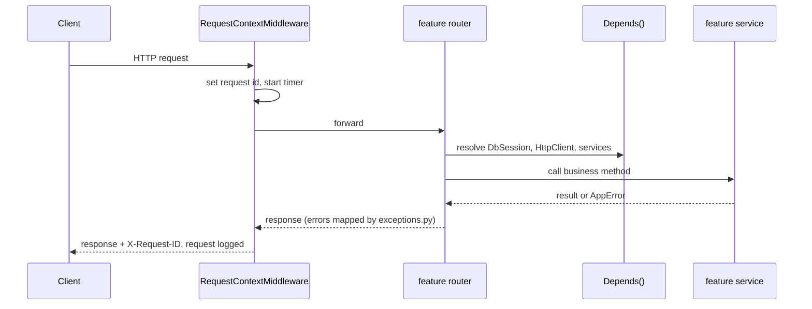

# Integration Service Documentation

> Last updated: 2026-09-28

## Layout

```
app/
├── connectors/          # Connectors: Python ones and the config-driven http/
├── main.py              # create_app(), lifespan, middleware and router wiring
├── api/
│   └── router.py        # api_v1_router: mounts feature routers under /api/v1
├── core/                # Infrastructure every feature relies on
│   ├── config.py        # Settings, get_settings()
│   ├── context.py       # Request-scoped context variables (request id)
│   ├── logging.py       # JSON / text logging with request id
│   ├── middleware.py    # RequestContextMiddleware
│   ├── exceptions.py    # AppError hierarchy and exception handlers
│   ├── database.py      # Async engine, sessions, ORM Base, DbSession
│   ├── models.py        # UTCDateTime, UUID and timestamp mixins
│   ├── security.py      # Argon2 password hashing, JWT access tokens
│   ├── api_keys.py      # Client API key generation and verification
│   ├── encryption.py    # Fernet encryption for stored secrets
│   ├── secret_store.py  # AWS Secrets Manager + KMS, local fallback
│   └── http_client.py   # Shared httpx client, HttpClient dependency
├── shared/              # Feature-agnostic schemas and helpers
│   ├── schemas.py       # ErrorResponse, Page[ItemT]
│   └── pagination.py    # Pagination query dependency
└── features/
    ├── clients/         # Client projects, API keys, per-client settings
    ├── health/          # Liveness and readiness probes
    ├── integration_tools/ # Tools that fulfil types; client tool listing
    ├── integration_types/ # Catalogue of integration types (DB-driven)
    ├── super_admins/    # Super admin registration, login, profile
    └── user_connections/ # Per-user connections run through connectors
migrations/              # Alembic (env.py reads DATABASE_URL from settings)
```

## Request lifecycle



## Layer rules

| Layer                        | Responsibility                           | Must not                               |
|------------------------------|------------------------------------------|----------------------------------------|
| `router.py`                  | Parse input, call service, shape output  | Run SQL, hold business rules           |
| `service.py`                 | Business rules, transactions, providers  | Import `Request` or `HTTPException`    |
| `repository.py`              | Database queries for one aggregate       | Make business decisions                |
| `schemas.py`                 | Pydantic request/response models         | Touch the database                     |
| `dependencies.py`            | Wire sessions, clients, services         | Contain logic beyond construction      |

## Adding a feature

1. Create `app/features/<feature_name>/` with the files the feature
   needs from the table above. Start with `router.py`, `schemas.py`,
   `service.py`, and `dependencies.py`; add `models.py`,
   `repository.py`, and `exceptions.py` when the feature needs them.
2. Raise `AppError` subclasses from the service (define feature-specific
   ones in the feature's `exceptions.py`).
3. Register the router in `app/api/router.py`:

   ```python
   api_v1_router.include_router(verifications_router)
   ```

4. If the feature has models, import its `models` module in
   `migrations/env.py`, then run
   `uv run alembic revision --autogenerate -m "<change>"` and review
   the generated file.
5. Add tests under `tests/features/<feature_name>/`, overriding
   dependencies through `app.dependency_overrides`.
6. Write `docs/features/<feature_name>.md` from the feature template.

## Index

Core modules:

- [config](core/config.md)
- [context and logging](core/logging.md)
- [middleware](core/middleware.md)
- [exceptions](core/exceptions.md)
- [database](core/database.md)
- [http_client](core/http_client.md)
- [models](core/models.md)
- [security](core/security.md)
- [api_keys](core/api_keys.md)
- [encryption](core/encryption.md)
- [secret_store](core/secret_store.md)

Features:

- [client_integrations](features/client_integrations.md)
- [clients](features/clients.md)
- [health](features/health.md)
- [integration_tools](features/integration_tools.md)
- [integration_types](features/integration_types.md)
- [super_admins](features/super_admins.md)
- [user_connections](features/user_connections.md)

Guides:

- [connectors: configuration-driven and Python](connectors.md)

Integrations:

- [SurePass](integrations/surepass.md)
