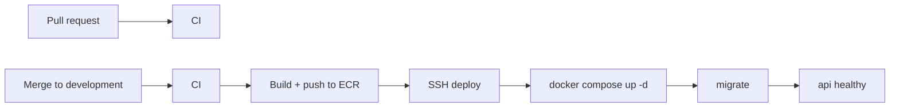

# CI/CD

> Last updated: 2026-09-29

Two GitHub Actions workflows in `.github/workflows/`:

| Workflow | Trigger | Does |
|----------|---------|------|
| `ci.yml` (**CI**) | Every push (except `development`) and pull request; also called by the deploy workflow | Lint, format, tests, migrations on MySQL 8, Docker build and smoke test |
| `deploy-development.yml` (**Deploy development**) | Push to `development` (every merged PR), or run manually | CI, then build and push to ECR, then deploy to the server |



## CI jobs

| Job | Checks |
|-----|--------|
| **Lint and tests** | No committed `.env`; `uv sync --frozen`; `ruff check`; `ruff format --check`; `pytest` |
| **Migrations on MySQL** | `alembic upgrade head`, `alembic check` (no model drift), then downgrade to base and upgrade again on a real MySQL 8.0 |
| **Docker image** | `docker compose config`; builds the image; runs it read-only with dropped capabilities and waits for `/health/live` |

CI needs no secrets; every value it uses is fake.

## Deployment

1. **CI** runs in full.
2. **Build and push**: the image is tagged with the commit
   (`<registry>/everycred-integration-service:<sha>`) and `:development`,
   and pushed to ECR in `ap-south-1`.
3. **Deploy**: `docker-compose.yml` is copied to the server; over SSH the
   job writes `.env` from the `ENV` secret (mode 600), logs in to ECR, and
   runs `docker compose up -d` with `INTEGRATION_IMAGE=<that sha>` and
   `PULL_POLICY=always`. Compose runs `migrate` first; the API starts only
   if migrations succeed. The job then waits up to 150 s for the API to
   report healthy and fails, printing logs, if it does not.

Deploys never overlap and are never cancelled midway. The server always
runs the exact image that passed CI for that commit.

## One-time setup

### 1. ECR repository

```bash
aws ecr create-repository --region ap-south-1 \
  --repository-name everycred-integration-service \
  --image-scanning-configuration scanOnPush=true
```

### 2. GitHub environment and secrets

In the repository: **Settings → Environments → New environment →
`development`**. Optionally add required reviewers there to approve each
deploy.

Add these **environment secrets**:

| Secret | Value |
|--------|-------|
| `AWS_ACCESS_KEY_ID`, `AWS_SECRET_ACCESS_KEY` | An IAM user allowed to push to the ECR repository only (`ecr:GetAuthorizationToken`, plus `ecr:BatchCheckLayerAvailability`, `ecr:InitiateLayerUpload`, `ecr:UploadLayerPart`, `ecr:CompleteLayerUpload`, `ecr:PutImage`, `ecr:BatchGetImage` on the repository) |
| `HOST` | Server address |
| `USERNAME` | SSH user on the server (in the `docker` group) |
| `SSH_KEY` | That user's private key (PEM) |
| `ENV` | The full `.env` for the server, exactly as in [deployment](deployment.md#1-prepare-the-environment) |

Optional **environment variable**:

| Variable | Default |
|----------|---------|
| `DEPLOY_PATH` | `/opt/everycred-integration-service` |

The deploy job checks these first and fails with a list of anything
missing.

### 3. Server

- Docker Engine with the Compose v2 plugin, and the AWS CLI.
- The deploy user can run `docker` and owns `DEPLOY_PATH`:

  ```bash
  sudo mkdir -p /opt/everycred-integration-service
  sudo chown "$USER" /opt/everycred-integration-service
  ```

- The server can pull from ECR: an instance role with
  `AmazonEC2ContainerRegistryReadOnly` (and the IMDSv2 hop limit of 2
  described in [deployment](deployment.md#aws-credentials)), or AWS CLI
  credentials for the deploy user.
- The nginx location from `deploy/nginx/integration-subpath.conf` is in
  place (once; CI/CD does not touch nginx).

## Changing settings

Update the `ENV` secret, then run **Deploy development** manually
(**Actions → Deploy development → Run workflow**). Every deploy rewrites
`.env` from the secret, so edits made by hand on the server are
overwritten.

## Rolling back

Redeploy the previous commit: revert the bad merge on `development`
(which deploys the reverted code), or on the server:

```bash
cd /opt/everycred-integration-service
INTEGRATION_IMAGE=<registry>/everycred-integration-service:<previous sha> \
  PULL_POLICY=always docker compose up -d
```

If the bad release included a migration, downgrade it first with
`docker compose run --rm migrate alembic downgrade -1` using the new
image; CI proves every downgrade works, but take a backup before either
step.

## Security notes

- Secrets live in the `development` environment, not repository-wide, so
  they are available only to jobs that declare `environment: development`.
- Workflows request `contents: read` only.
- CI runs on pull requests without access to any secret.
- For stronger AWS security, replace the access keys with GitHub OIDC
  (`role-to-assume` in `aws-actions/configure-aws-credentials`) so no
  long-lived key is stored.
