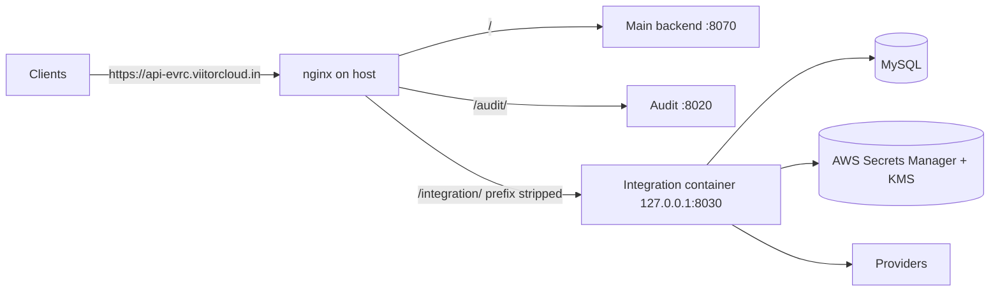

# Deployment

> Last updated: 2026-09-29

The service runs as a Docker container on the same host as the existing
EveryCRED backend and is published on the **shared backend domain** under
`/integration/`, the same way the audit service is mounted at `/audit/`.



| Public URL | Reaches |
|------------|---------|
| `https://api-evrc.viitorcloud.in/integration/api/v1/...` | The API |
| `https://api-evrc.viitorcloud.in/integration/health/live` | Liveness |
| `https://api-evrc.viitorcloud.in/integration/health/ready` | Readiness (checks MySQL) |
| `https://api-evrc.viitorcloud.in/integration/docs`, `/redoc` | Only if `ENABLE_DOCS=true` and not production |

## Files

| File | Purpose |
|------|---------|
| `Dockerfile` | Multi-stage image: dependencies built with uv, slim non-root runtime (uid 10001), health check |
| `deploy/docker-entrypoint.sh` | `serve` (uvicorn) or `migrate` (Alembic) |
| `docker-compose.yml` | `migrate` runs once, then `api` starts; port published on loopback only |
| `deploy/nginx/integration-subpath.conf` | Upstream and `location /integration/` to paste into the existing vhost |
| `.dockerignore` | Keeps `.env`, `.venv`, tests, and docs out of the image |

## 1. Prepare the environment

On the server, in the repository directory:

```bash
cp .env.example .env
```

Set at least:

| Variable | Deployed value |
|----------|----------------|
| `ENVIRONMENT` | `production` (or `staging`) |
| `DATABASE_URL` | `mysql+aiomysql://<user>:<password>@host.docker.internal:3306/everycred_integration?charset=utf8mb4` — `host.docker.internal` is MySQL on the host; use the DB host name for a separate server |
| `JWT_SECRET_KEY`, `API_KEY_HASH_SECRET`, `CONNECTION_ENCRYPTION_KEYS` | New random values (generation commands in `.env.example`) |
| `SUPER_ADMIN_BOOTSTRAP_TOKEN` | Set for the first deploy only; remove after creating the first super admin |
| `SECRET_STORE_BACKEND` | `aws` (required in production) |
| `AWS_REGION`, `SECRETS_KMS_KEY_ID` | Region and KMS key for the secret store |
| `LOG_JSON` | `true` |
| `ENABLE_DOCS` | `false` in production |
| `CORS_ALLOWED_ORIGINS` | Only the frontends that call this service directly, e.g. `["https://admin.example.com"]` |

`ROOT_PATH`, `PORT`, and `WEB_CONCURRENCY` are set in `docker-compose.yml`,
not `.env`.

Restrict the file: `chmod 600 .env`.

### MySQL

Create the database and a user limited to it (do not use root):

```sql
CREATE DATABASE everycred_integration CHARACTER SET utf8mb4 COLLATE utf8mb4_unicode_ci;
CREATE USER 'everycred_integration'@'%' IDENTIFIED BY '<strong password>';
GRANT SELECT, INSERT, UPDATE, DELETE, CREATE, ALTER, DROP, INDEX, REFERENCES
  ON everycred_integration.* TO 'everycred_integration'@'%';
```

Narrow `'%'` to the Docker bridge subnet or the host's address if MySQL
listens beyond localhost. MySQL on the host must accept connections from
the Docker bridge (`bind-address` not limited to `127.0.0.1`).

### AWS credentials

The container uses the standard AWS credential chain.

- **EC2 instance role (recommended):** attach a role with the policy from
  [secret store](core/secret_store.md). Containers on the default bridge
  network are one extra network hop from the instance metadata service,
  so set the instance's IMDSv2 **hop limit to 2**, or the SDK cannot get
  credentials:

  ```bash
  aws ec2 modify-instance-metadata-options --instance-id <id> \
    --http-put-response-hop-limit 2 --http-tokens required
  ```

- **Access keys:** only if no role is possible; put
  `AWS_ACCESS_KEY_ID` / `AWS_SECRET_ACCESS_KEY` in `.env`.

## 2. Build and start

```bash
docker compose build
docker compose up -d
docker compose ps           # migrate: Exited (0), api: Up (healthy)
docker compose logs -f api
```

`migrate` applies every pending Alembic migration and exits; `api` starts
only if it succeeded. The API listens on `127.0.0.1:8030`, so it is not
reachable from outside the host except through nginx.

Check locally on the server:

```bash
curl -s http://127.0.0.1:8030/health/live     # {"status":"ok"}
curl -s http://127.0.0.1:8030/health/ready    # {"is_ready":true,...}
```

## 3. Add the nginx location

Edit the existing vhost for `api-evrc.viitorcloud.in` (the one that already
contains `location /audit/`):

1. Put the `upstream integration_api { ... }` block at the top of the file,
   outside any `server { }` block.
2. Paste the `location = /integration` and `location /integration/` blocks
   inside the existing `listen 443 ssl` server block.

Both are in `deploy/nginx/integration-subpath.conf`. Then:

```bash
sudo nginx -t && sudo systemctl reload nginx
curl -s https://api-evrc.viitorcloud.in/integration/health/live
```

The trailing slash in `proxy_pass http://integration_api/;` strips the
prefix, and `ROOT_PATH=/integration` tells the app about it. Change both
together if the mount point ever changes.

## 4. First super admin

Once, with the bootstrap token from `.env`:

```bash
curl -X POST https://api-evrc.viitorcloud.in/integration/api/v1/super-admins/register \
  -H "Content-Type: application/json" \
  -H "X-Bootstrap-Token: <SUPER_ADMIN_BOOTSTRAP_TOKEN>" \
  -d '{"email": "admin@example.com", "full_name": "Platform Admin", "password": "<12+ characters>"}'
```

Then remove `SUPER_ADMIN_BOOTSTRAP_TOKEN` from `.env` and run
`docker compose up -d` to apply it.

## Updating

```bash
git pull
docker compose build
docker compose up -d        # migrate runs again first; no-op if up to date
```

Migrations run before the new API starts. Review migrations before
deploying: MySQL runs DDL outside transactions, so a failed migration can
leave the schema partly changed. Take a database backup first.

## Operations

| Task | Command |
|------|---------|
| Logs | `docker compose logs -f api` (JSON lines when `LOG_JSON=true`) |
| Restart | `docker compose restart api` |
| Current migration | `docker compose run --rm migrate alembic current` |
| Shell in a new container | `docker compose run --rm api sh` |
| Stop | `docker compose down` |

## Hardening in place

- Non-root user, read-only root filesystem, all Linux capabilities dropped,
  `no-new-privileges`.
- Port bound to `127.0.0.1` only; nginx terminates TLS.
- No compiler, uv, or build cache in the runtime image; `.env` excluded
  from the build context.
- Memory and CPU limits (`768m`, `1.0` CPU) and log rotation (5 × 20 MB).
- uvicorn's `Server` header disabled.
- Production refuses to start without the AWS secret store.
