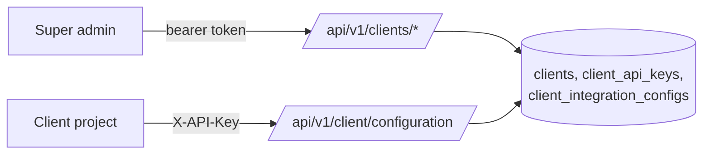
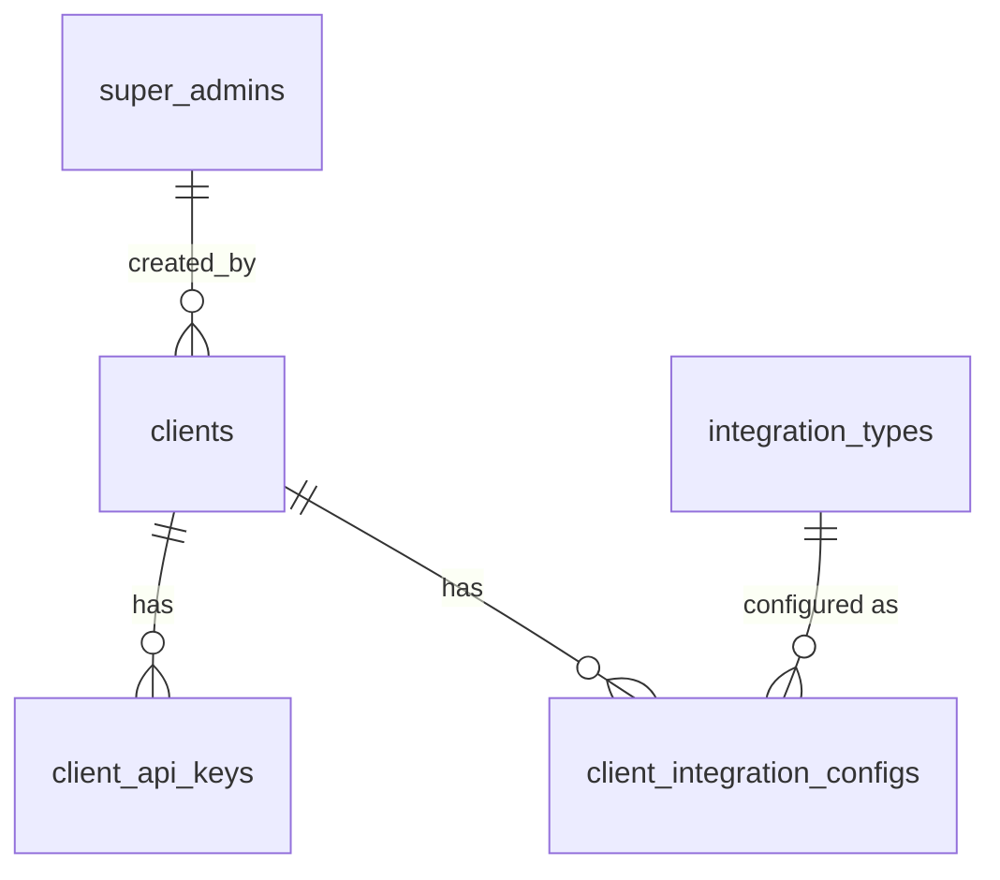

# Clients, API Keys, and Client Configuration

> Package: `app/features/clients/`
> Last updated: 2026-09-28

## Overview

A **client** is a project that integrates with this service, for
example the issuer portal or the wallet backend. Super admins register
clients, issue each one API keys, and decide which integration types
it uses and with what settings. The client then calls the service with
its API key and receives its own configuration.



## Endpoints

### Super admin (bearer token)

| Method | Path | Summary |
|--------|------|---------|
| POST   | `/api/v1/clients` | Register a client |
| GET    | `/api/v1/clients` | List clients (paginated, `include_inactive`) |
| GET    | `/api/v1/clients/{client_id}` | Get a client |
| POST   | `/api/v1/clients/{client_id}/api-keys` | Generate an API key |
| GET    | `/api/v1/clients/{client_id}/api-keys` | List keys (metadata only) |
| POST   | `/api/v1/clients/{client_id}/api-keys/{api_key_id}/revoke` | Revoke a key |
| GET    | `/api/v1/clients/{client_id}/integrations` | List the client's integration settings |
| PUT    | `/api/v1/clients/{client_id}/tools/{tool_code}/credentials` | Store the client's credentials for a tool (secret store) |
| GET    | `/api/v1/clients/{client_id}/tools/{tool_code}/credentials` | Stored credential names, never values |
| DELETE | `/api/v1/clients/{client_id}/tools/{tool_code}/credentials` | Remove them |
| PUT    | `/api/v1/clients/{client_id}/integrations/{integration_type_code}` | Enable a type, choose its tool, set settings |

### Client (API key)

| Method | Path | Summary |
|--------|------|---------|
| GET    | `/api/v1/client/configuration` | The calling client's configuration |
| PUT    | `/api/v1/client/integrations/{integration_type_code}/settings` | Replace the client's own settings for an enabled type |
| GET    | `/api/v1/client/integration-tools` | Tools usable for the client (see [integration tools](integration_tools.md)) |

## Walkthrough

### 1. Register a client

```bash
curl -X POST http://localhost:8000/api/v1/clients \
  -H "Authorization: Bearer <super admin token>" \
  -H "Content-Type: application/json" \
  -d '{"code": "issuer-portal", "name": "Issuer Portal"}'
```

`code` is lower-case letters and digits separated by single `-` or `_`,
2–50 characters, and unique.

### 2. Generate an API key

```bash
curl -X POST http://localhost:8000/api/v1/clients/<client_id>/api-keys \
  -H "Authorization: Bearer <super admin token>" \
  -H "Content-Type: application/json" \
  -d '{"name": "production", "expires_at": "2027-09-28T00:00:00Z"}'
```

`expires_at` is optional and must include a time zone and be in the
future. Response `201`, sent with `Cache-Control: no-store`:

```json
{
  "id": "00000000-0000-0000-0000-000000000000",
  "name": "production",
  "key_prefix": "3f9a1c07b2de",
  "expires_at": "2027-09-28T00:00:00Z",
  "revoked_at": null,
  "last_used_at": null,
  "created_at": "2026-09-28T09:00:00Z",
  "api_key": "eci_3f9a1c07b2de_<secret>"
}
```

**`api_key` appears only in this response.** Store it in the client's
secret store straight away; it cannot be retrieved again. If it is
lost, issue a new key and revoke the old one.

### 3. Configure integrations

Pass `tool_code` to choose which [integration tool](integration_tools.md)
the client uses for the type; its connector runs when the client's
users connect.

```bash
curl -X PUT http://localhost:8000/api/v1/clients/<client_id>/integrations/confirm \
  -H "Authorization: Bearer <super admin token>" \
  -H "Content-Type: application/json" \
  -d '{"is_enabled": true, "settings": {"callback_url": "https://portal.example.com/hook"}}'
```

`PUT` replaces the whole configuration; settings are not merged. The
integration type must exist (see [integration types](integration_types.md)).

### 4. Client reads its configuration

```bash
curl http://localhost:8000/api/v1/client/configuration \
  -H "X-API-Key: eci_3f9a1c07b2de_<secret>"
```

```json
{
  "client": {
    "id": "00000000-0000-0000-0000-000000000000",
    "code": "issuer-portal",
    "name": "Issuer Portal"
  },
  "integrations": [
    {
      "integration_type_code": "confirm",
      "integration_type_name": "Confirm",
      "is_enabled": true,
      "settings": {"callback_url": "https://portal.example.com/hook"},
      "updated_at": "2026-09-28T09:05:00Z"
    }
  ]
}
```

Only enabled configurations of active integration types are returned,
ordered like the integration type catalogue.

### 5. Client updates its own settings

```bash
curl -X PUT http://localhost:8000/api/v1/client/integrations/confirm/settings \
  -H "X-API-Key: eci_3f9a1c07b2de_<secret>" \
  -H "Content-Type: application/json" \
  -d '{"settings": {"callback_url": "https://portal.example.com/hook"}}'
```

- Allowed only for types a super admin has enabled for the client
  (`403 integration_not_enabled` otherwise).
- Only `settings` can be sent; `is_enabled` or `tool_code` in the body
  is rejected with `422`. Those stay super admin decisions.
- Settings are replaced, not merged, and limited to 16 KB.

### 6. Store the client's tool credentials

```bash
curl -X PUT http://localhost:8000/api/v1/clients/<client_id>/tools/surepass/credentials \
  -H "Authorization: Bearer <super admin token>" \
  -H "Content-Type: application/json" \
  -d '{"credentials": {"api_token": "<provider token>"}}'
```

Values go to the [secret store](../core/secret_store.md); the
`client_tool_credentials` row keeps only the reference and the names.
Names must match the tool's `{credentials.<name>}` placeholders. Calling
again replaces (rotates) them.

## Errors

| Status | `error.code`                 | When |
|--------|------------------------------|------|
| 401    | `authentication_failed`      | Admin routes: missing or invalid bearer token |
| 401    | `invalid_api_key`            | Client route: key missing, malformed, unknown, revoked, expired, or client inactive |
| 403    | `permission_denied`          | Bearer token for a role other than super admin |
| 404    | `client_not_found`           | Unknown `client_id` |
| 404    | `api_key_not_found`          | Key does not exist *for that client* |
| 404    | `integration_type_not_found` | Unknown integration type code |
| 403    | `integration_not_enabled`    | Client settings update for a type not enabled |
| 404    | `integration_tool_not_found` | Unknown `tool_code` |
| 409    | `client_code_taken`          | Client code already used |
| 422    | `integration_tool_not_usable` | Tool does not serve the type or is inactive |
| 422    | `validation_error`           | Bad code, past expiry, settings over 16 KB, unknown field |

## Data model



| Table | Key columns | Notes |
|-------|-------------|-------|
| `clients` | `code` (unique), `name`, `is_active` | |
| `client_api_keys` | `client_id`, `key_prefix` (unique), `key_hash`, `expires_at`, `revoked_at`, `last_used_at` | Deleted with the client (`CASCADE`) |
| `client_integration_configs` | `client_id`, `integration_type_id`, `is_enabled`, `settings` (JSON) | Unique per client and type; deleted with the client; blocks deleting an integration type in use (`RESTRICT`) |

Migration: `a5e740c50a94`.

## Design decisions

- **Several keys per client.** Separate keys for staging and
  production, and rotation without downtime: issue the new key, deploy
  it, then revoke the old one.
- **Hash only.** See [api_keys](../core/api_keys.md) for the format and
  why HMAC-SHA256 is used.
- **One error for every bad key.** Callers cannot tell a revoked key
  from a mistyped one. Revoked, expired, and inactive-client rejections
  are logged with the key prefix so operators can see why.
- **`last_used_at` is approximate.** It is written at most every five
  minutes per key, so heavy traffic does not turn every read into a
  database write.
- **Keys are scoped to their client in admin routes.** Revoking uses
  both `client_id` and `api_key_id`, so a mistyped client id cannot
  revoke another client's key.
- **Settings hold no secrets.** They are returned to the client and
  shown to admins. Provider credentials belong in AWS Secrets Manager.

## Known limitations

- No update or deactivate endpoint for clients yet; `is_active` is
  changed in the database.
- No per-key rate limiting.
- Keys are all-or-nothing; there are no scopes.

## Testing

- `tests/features/clients/test_clients.py` — client registration and
  listing.
- `tests/features/clients/test_api_keys.py` — key format, hashing,
  listing without secrets, revoke, expiry, inactive clients.
- `tests/features/clients/test_configurations.py` — upsert, validation,
  and per-client isolation of configurations.
