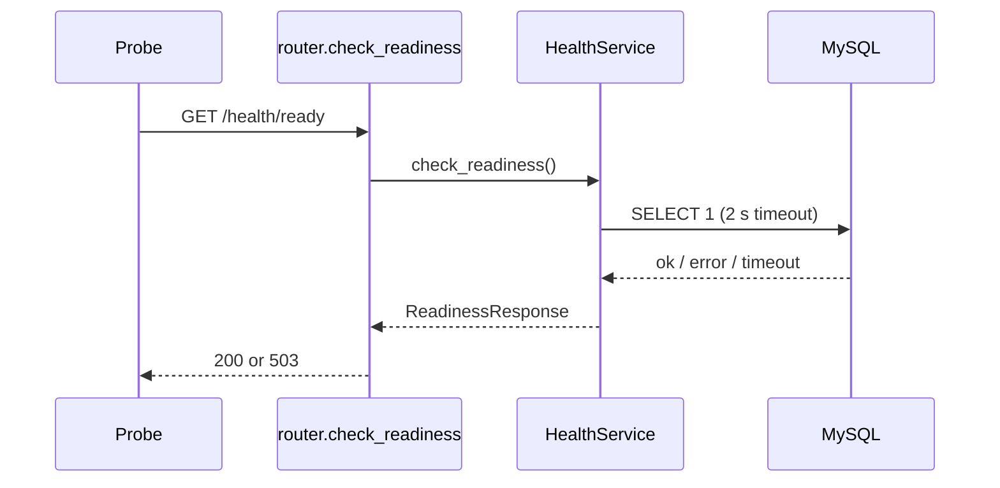

# Health

> Package: `app/features/health/`
> Last updated: 2026-09-28

## Overview

Liveness and readiness probes for load balancers and Kubernetes. They
are mounted at the root, outside `/v1`, and need no authentication.

## Endpoints

| Method | Path            | Summary                                | Auth |
|--------|-----------------|----------------------------------------|------|
| GET    | `/health/live`  | Process is up                          | None |
| GET    | `/health/ready` | Dependencies are reachable             | None |

### `GET /health/live`

Always returns `200` while the process can serve requests. It checks
nothing external on purpose: if it failed during a database outage, the
orchestrator would restart pods that are healthy.

```json
{"status": "ok"}
```

### `GET /health/ready`

Checks each dependency. Returns `200` when all are available and `503`
otherwise, so traffic is routed away until they recover.

```json
{"is_ready": false, "components": {"database": "unavailable"}}
```

The response names the failed component but never includes the error,
which could contain hostnames or connection details. The full error is
logged by `HealthService`.

## Flow



## Design decisions

- `DATABASE_CHECK_TIMEOUT_SECONDS = 2.0` keeps the check shorter than a
  typical probe timeout, so the endpoint answers `503` rather than the
  probe timing out.
- New dependencies (secrets manager, provider APIs) are added as extra
  entries in `components` inside `HealthService.check_readiness`. Only
  add ones whose outage should stop this instance taking traffic.

## Testing

- `tests/features/health/test_router.py` replaces `get_health_service`
  with a fake through `app.dependency_overrides`.
- Manual check:

  ```bash
  curl -i http://localhost:8000/health/ready
  ```
