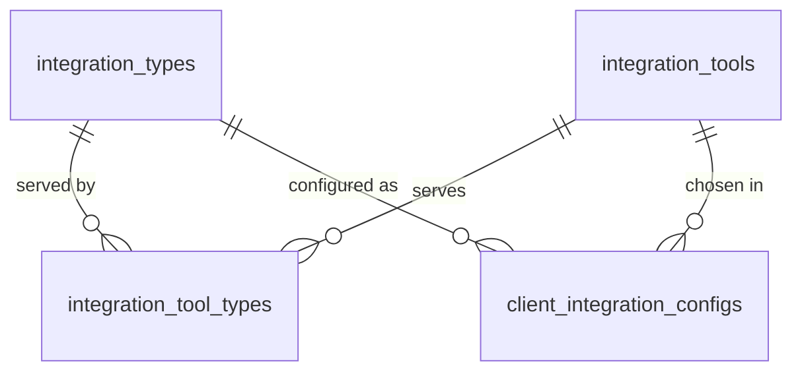

# Integration Tools

> Package: `app/features/integration_tools/`
> Last updated: 2026-09-28

## Overview

An **integration tool** is an external product that fulfils one or more
integration types: for example, one KYC vendor's API might serve both
Confirm and Gather. Tools are stored in the database, so a new one
appears in the listings as soon as its row exists.

Each client configuration names the tool the client uses for a type
(chosen by a super admin). When a client's user connects, the service
runs that **tool's connector** (see [writing a connector](../connectors.md)).



## Endpoints

| Method | Path | Auth | Summary |
|--------|------|------|---------|
| GET | `/v1/integration-tools` | Super admin | Whole catalogue |
| GET | `/v1/client/integration-tools` | `X-API-Key` | Tools usable for the calling client |
| PUT | `/v1/integration-tools/{tool_code}` | Super admin | Create or replace a tool, including its `connector_config` |

### Admin listing

Query parameters: `limit`, `offset`, `integration_type` (type code),
`include_inactive` (default `false`).

### Client listing

Query parameters: `limit`, `offset`, `integration_type`. Returns only
**active** tools that serve at least one type **enabled for the
client**, and each tool lists only those enabled types, so a client
never learns about other types.

### Response item

```json
{
  "id": "00000000-0000-0000-0000-000000000000",
  "code": "acme-verify",
  "name": "Acme Verify",
  "provider": "Acme",
  "description": null,
  "is_active": true,
  "display_order": 10,
  "integration_types": [
    {"code": "confirm", "name": "Confirm"},
    {"code": "gather", "name": "Gather"}
  ],
  "connector": {
    "is_available": true,
    "parameters": [
      {"name": "api_token", "kind": "positional_or_keyword", "required": true, "annotation": "str"},
      {"name": "region", "kind": "keyword_only", "required": false, "annotation": "str"}
    ]
  },
  "created_at": "2026-09-28T12:00:00Z",
  "updated_at": "2026-09-28T12:00:00Z"
}
```

`connector.parameters` is read from the connector's `connect`
signature at request time, so it always matches the code. Clients use
it to know which `args` and `kwargs` to save for their users. Default
values are never published.

## Adding a tool

Use the admin API; it validates everything, including the connector
configuration (see [connectors](../connectors.md)):

```bash
curl -X PUT http://localhost:8000/v1/integration-tools/surepass \
  -H "Authorization: Bearer <super admin token>" \
  -H "Content-Type: application/json" \
  --data @docs/examples/surepass-tool.json
```

The whole definition is replaced on each call. The listing's
`connector.kind` is `http` for configured tools and `code` for Python
connectors, and `connector.operations` lists each operation with the
`kwargs` and credentials it needs.

Tools can also be inserted with SQL, then linked to the types they
serve:

```sql
INSERT INTO integration_tools
    (id, code, name, provider, description, is_active, display_order, created_at, updated_at)
VALUES
    (REPLACE(UUID(), '-', ''), 'acme-verify', 'Acme Verify', 'Acme', NULL, 1, 10,
     UTC_TIMESTAMP(), UTC_TIMESTAMP());

INSERT INTO integration_tool_types (integration_tool_id, integration_type_id)
SELECT tool.id, type.id
FROM integration_tools AS tool
JOIN integration_types AS type ON type.code IN ('confirm', 'gather')
WHERE tool.code = 'acme-verify';
```

Then add its connector in `app/connectors/acme_verify.py` with
`@register_connector("acme-verify")`. Until then the tool is listed
with `connector.is_available: false` and connect calls answer `501`.

- Hide a tool with `is_active = 0`; it disappears from client listings
  and can no longer be chosen, and connects through it answer `409`.
- A tool still chosen by any client cannot be deleted (`RESTRICT`).
- Treat `code` as permanent: it links the row to its connector.

## Choosing a tool for a client

Super admins pass `tool_code` when setting a client's configuration:

```bash
curl -X PUT http://localhost:8000/v1/clients/<client_id>/integrations/confirm \
  -H "Authorization: Bearer <super admin token>" \
  -H "Content-Type: application/json" \
  -d '{"is_enabled": true, "tool_code": "acme-verify", "settings": {}}'
```

| Status | `error.code` | When |
|--------|--------------|------|
| 404 | `integration_tool_not_found` | No tool has that code |
| 422 | `integration_tool_not_usable` | Tool does not serve the type, or is inactive |

Sending `"tool_code": null` (or omitting it) clears the choice. The
`PUT` replaces the whole configuration, as before.

## Data model

| Table | Key columns | Notes |
|-------|-------------|-------|
| `integration_tools` | `code` (unique), `name`, `provider`, `is_active`, `display_order` | |
| `integration_tool_types` | (`integration_tool_id`, `integration_type_id`) primary key | Rows go with either side (`CASCADE`) |
| `client_integration_configs.integration_tool_id` | nullable FK | `RESTRICT` on tool delete |

Migration: `f536a4db8356`.

## Testing

- `tests/features/integration_tools/test_listing.py` — admin and client
  listings, filters, parameter description.
- `tests/features/integration_tools/test_client_configuration.py` —
  tool choice validation and client-edited settings.
