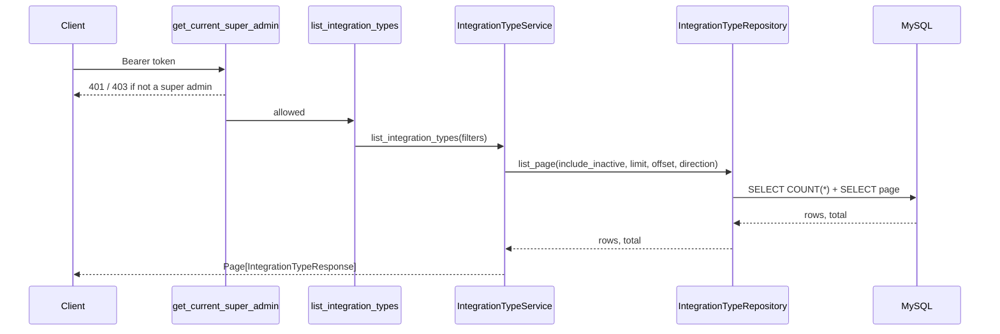

# Integration Types

> Package: `app/features/integration_types/`
> Last updated: 2026-10-02

## Overview

The catalogue of integration types the service offers: Confirm,
Gather, Enforcement, and Records to start with. Types live in the
`integration_types` table rather than in code, so a new type is added
by inserting a row. The listing API returns it on the next request, with
no deployment or restart.

The API is for super admins only.

## Endpoints

| Method | Path                       | Summary                 | Auth              |
|--------|----------------------------|-------------------------|-------------------|
| GET    | `/v1/integration-types` | List integration types | Super admin token |

### `GET /v1/integration-types`

Query parameters:

| Name               | Default | Rules    | Meaning                          |
|--------------------|---------|----------|----------------------------------|
| `limit`            | `20`    | 1–100    | Page size                        |
| `offset`           | `0`     | ≥ 0      | Rows to skip                     |
| `include_inactive` | `false` |          | Also return types switched off   |
| `direction`        | `all`   | `all`, `inbound`, `outbound` | Only types of this direction; `all` (or leaving it out) returns both |

Unknown parameters are rejected with `422`.

```bash
curl http://localhost:8000/v1/integration-types \
  -H "Authorization: Bearer <super admin access token>"

# Inbound types only: confirm, gather, declare
curl "http://localhost:8000/v1/integration-types?direction=inbound" \
  -H "Authorization: Bearer <super admin access token>"
```

Response `200 OK`:

```json
{
  "items": [
    {
      "id": "00000000-0000-0000-0000-000000000000",
      "code": "confirm",
      "name": "Confirm",
      "description": null,
      "is_active": true,
      "display_order": 10,
      "direction": "inbound",
      "created_at": "2026-09-28T08:33:39Z",
      "updated_at": "2026-09-28T08:33:39Z"
    }
  ],
  "total": 4,
  "limit": 20,
  "offset": 0
}
```

Items are ordered by `display_order`, then `name`.

Errors:

| Status | `error.code`            | When                                   |
|--------|-------------------------|----------------------------------------|
| 401    | `authentication_failed` | No token, or an invalid/expired token  |
| 403    | `permission_denied`     | Token belongs to a role other than super admin |
| 422    | `validation_error`      | `limit`/`offset` out of range, unknown `direction`, unknown parameter |

## Adding a type

Insert a row. `id` is a UUID without dashes (`CHAR(32)`), and times are
UTC:

```sql
INSERT INTO integration_types
    (id, code, name, description, is_active, display_order, direction, created_at, updated_at)
VALUES
    (REPLACE(UUID(), '-', ''), 'payments', 'Payments', NULL, 1, 60, 'outbound',
     UTC_TIMESTAMP(), UTC_TIMESTAMP());
```

- `direction` is `inbound` (data comes into EveryCRED) or `outbound`
  (EveryCRED acts on or reports to other systems). Left out, it is
  `inbound`.

- Choose `display_order` to place it in the list; the seed uses steps of
  10 so a type can be slotted between existing ones.
- To hide a type without deleting it, set `is_active = 0`.
- Treat `code` as permanent once anything references it.

For a type every environment must have, add it in a new Alembic data
migration instead of by hand, so development, staging, and production
stay identical.

## Flow



## Data model

Table `integration_types` (migration `18ecd5dab8cc`):

| Column          | Type           | Notes                             |
|-----------------|----------------|-----------------------------------|
| `id`            | `CHAR(32)`     | UUID primary key                  |
| `code`          | `VARCHAR(50)`  | Unique (`uq_integration_types_code`) |
| `name`          | `VARCHAR(100)` | Display label                     |
| `description`   | `TEXT`         | Nullable                          |
| `is_active`     | `TINYINT(1)`   | Default `1`                       |
| `display_order` | `INT`          | Default `0`                       |
| `direction`     | `VARCHAR(20)`  | `inbound` (default) or `outbound` |
| `created_at`, `updated_at` | `DATETIME` | UTC                        |

Seeded rows (migrations `18ecd5dab8cc`, `c5f3f5bf92e7`, and
`6826c2876281` for `direction`):

| `code`        | `name`      | `description`                  | `display_order` | `direction` |
|---------------|-------------|--------------------------------|-----------------|-------------|
| `confirm`     | Confirm     | Identity & verification        | 10              | inbound     |
| `gather`      | Gather      | Systems of record (read-only)  | 20              | inbound     |
| `declare`     | Declare     | Holder & issuer input          | 30              | inbound     |
| `enforcement` | Enforcement | Physical access systems        | 40              | outbound    |
| `records`     | Records     | Audit & evidence               | 50              | outbound    |

The second migration only fills in empty descriptions and moves
`enforcement` and `records` if they are still at their seeded order, so
it keeps edits made directly in the table.

## Design decisions

- **Auth on the router, not the route.** `get_current_super_admin` is a
  router-level dependency, so any route added to this router later is
  protected automatically.
- **`code` and `name` are separate.** `code` is the stable key other
  tables and clients use; `name` can be reworded freely.
- **Stable ordering.** `id` is the last sort key so pagination never
  repeats or skips a row when two types share an order and name.
- **Soft hide over delete.** `is_active` lets a type be withdrawn while
  anything that references it keeps working.

## Known limitations

- No create, update, or delete endpoints yet; types are managed in the
  database.
- Descriptions are empty for the seeded types.

## Testing

`tests/features/integration_types/test_router.py` covers auth, order,
inactive filtering, pagination, invalid parameters, and a type added
straight to the database appearing in the next response.
