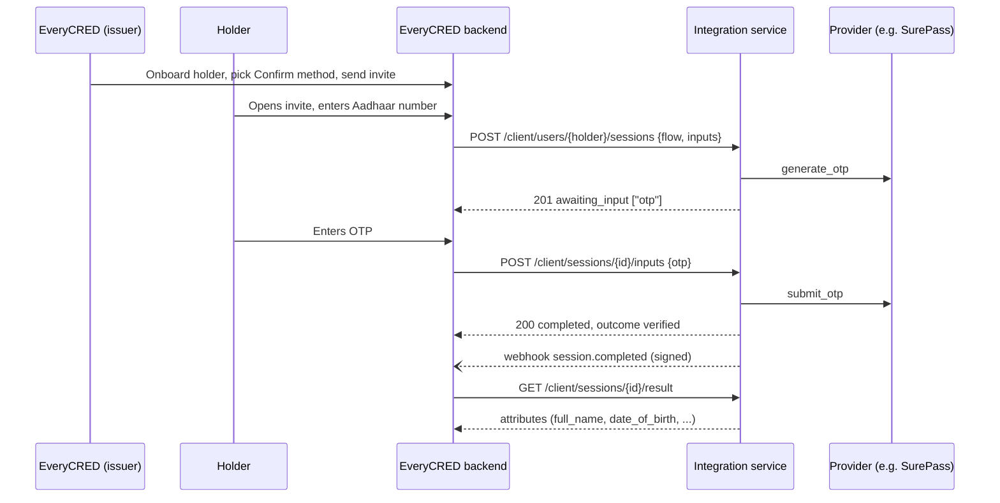

# Sessions (Confirm and Gather)

> Package: `app/features/sessions/` (worker in `app/worker.py`)
> Last updated: 2026-09-29

## Overview

A **session** runs one **flow** of an integration tool for one of a
client's users. It covers two integration types:

- **Confirm** (`purpose: verification`): is this person who they say
  they are? For example, an Aadhaar number followed by the OTP sent to
  the holder's phone. The outcome is `verified` or `not_verified`.
- **Gather** (`purpose: gather`): fetch the holder's attributes from a
  system of record such as an HRMS or Entra ID, to put into a
  credential. The outcome is `gathered`.

Flows are part of the tool's `connector_config` (see
[connectors](../connectors.md#flows)), so adding a new verification
method is a matter of configuration, not code.

### How EveryCRED uses it



The holder never talks to this service; the client's backend relays
what the holder enters. Clients other than EveryCRED use it the same
way with their own API key.

## Endpoints

All routes require `X-API-Key`. The client comes from the key, so a
client can only reach its own sessions (others return `404`).

| Method | Path | Summary |
|--------|------|---------|
| POST | `/api/v1/client/users/{user_uuid}/sessions` | Start a session |
| GET  | `/api/v1/client/users/{user_uuid}/sessions` | List a user's sessions (`status`, `integration_type`, `limit`, `offset`) |
| GET  | `/api/v1/client/sessions/{id}` | Poll status |
| POST | `/api/v1/client/sessions/{id}/inputs` | Submit what the session is waiting for |
| GET  | `/api/v1/client/sessions/{id}/result` | Read the attributes |
| POST | `/api/v1/client/sessions/{id}/cancel` | Cancel and discard inputs |

### Start

```bash
curl -X POST \
  https://<host>/integration/api/v1/client/users/<holder uuid>/sessions \
  -H "X-API-Key: <client api key>" \
  -H "Content-Type: application/json" \
  -d '{
        "integration_type": "confirm",
        "flow": "aadhaar_otp",
        "reference": "invite-7",
        "inputs": {"id_number": "<aadhaar number>"}
      }'
```

The tool is the one chosen for the type (`confirm` here) in the
client's configuration. Which flows a tool offers, and the inputs each
needs, is listed under `connector.flows` in the tool listing.

Response (`201`):

```json
{
  "id": "0b8e...",
  "status": "awaiting_input",
  "awaiting_inputs": ["otp"],
  "purpose": "verification",
  "outcome": null,
  "reference": "invite-7",
  "result_attributes": [],
  "expires_at": "2026-09-29T10:30:00Z"
}
```

Send inputs you already have up front; a flow whose inputs are all
present runs to the end in this one call.

### Submit inputs

```bash
curl -X POST https://<host>/integration/api/v1/client/sessions/<id>/inputs \
  -H "X-API-Key: <client api key>" -H "Content-Type: application/json" \
  -d '{"inputs": {"otp": "123456"}}'
```

### Result

```json
{
  "session_id": "0b8e...",
  "outcome": "verified",
  "attributes": {"full_name": "...", "date_of_birth": "1990-01-01"},
  "data_expires_at": "2026-10-06T10:05:00Z"
}
```

`attributes` is empty when `not_verified`. After `data_expires_at`
the endpoint returns `410 result_expired`.

## Lifecycle

| Status | Meaning |
|--------|---------|
| `awaiting_input` | Waiting for `awaiting_inputs`. |
| `processing` | Calling the provider (brief). |
| `completed` | The provider answered; see `outcome`. |
| `failed` | No answer could be obtained; see `failure_code`. |
| `expired` | Not finished within `SESSION_TTL_MINUTES`. |
| `cancelled` | Cancelled by the client. |

| `failure_code` | Cause |
|----------------|-------|
| `provider_rejected` | Provider said no (with `not_verified`), or refused a gather request. |
| `provider_error` / `provider_timeout` | Provider unreachable, garbage response, or too slow. |
| `unexpected_response` | A value the flow captures was missing from the response. |
| `missing_inputs` / `invalid_inputs` | An input could not be used. |
| `tool_credentials_missing` | The client has not stored the tool's credentials. |
| `integration_tool_changed`, `flow_misconfigured`, ... | The setup changed while the session was open. |
| `session_expired` | Timed out. |

Setup problems found **before** a session is created (type not
enabled, unknown flow, inputs the flow never uses) are ordinary API
errors (`403`, `404`, `422`) and create nothing.

## Data handling

- Inputs (document numbers, OTPs) and values captured between steps are
  kept in the [secret store](../core/secret_store.md) under
  `clients/<client>/sessions/<id>/state` **only while the session is
  active**, and deleted when it finishes, fails, expires or is cancelled.
- Result attributes are stored in the secret store under
  `.../result` and deleted by the worker at `data_expires_at`
  (`SESSION_DATA_RETENTION_DAYS`, default 7).
- The database row holds status, names of inputs and attributes, and
  references only. Status responses, webhooks and logs never contain
  values.
- Each provider call is recorded in `integration_operation_logs`
  (operation, success, status code, duration, request id) without
  inputs or results.

## Output mapping

A flow's `outputs` map attribute names to dot paths in the final
step's data (`org.department`, `items.0.id`) or to captured values
(`session.request_ref`). A client can add or override attributes per
tool from the Integrations drawer:

```bash
curl -X PUT https://<host>/integration/api/v1/client/integrations/acme-hrms \
  -H "X-API-Key: <client api key>" -H "Content-Type: application/json" \
  -d '{"field_mappings": {"employee_profile": {"employee_number": "employee_code"}}}'
```

Attributes whose path is absent from the response are left out.

## Webhooks and polling

When a session reaches `completed`, `failed` or `expired`, a
`session.completed`, `session.failed` or `session.expired` event is
queued for the client's [webhook](webhooks.md). The worker delivers it.
Polling `GET /client/sessions/{id}` works without a webhook.

## Worker

`python -m app.worker` (the `worker` compose service) runs every
`WORKER_INTERVAL_SECONDS`:

1. expires overdue sessions (polling also expires them on read),
2. delivers due webhook events with retries,
3. deletes results past retention.

Run exactly one worker per deployment.

## Settings

| Variable | Default | Meaning |
|----------|---------|---------|
| `SESSION_TTL_MINUTES` | 30 | Time to finish a session. |
| `SESSION_DATA_RETENTION_DAYS` | 7 | How long results are kept. |
| `WORKER_INTERVAL_SECONDS` | 5 | Worker round interval. |
| `CONNECTOR_TIMEOUT_SECONDS` | (existing) | Limit per provider call. |

## Concurrency

Submitting inputs moves the session from `awaiting_input` to
`processing` with a conditional `UPDATE`, so if two submissions race,
one proceeds and the other gets `409 session_not_awaiting_input`.
