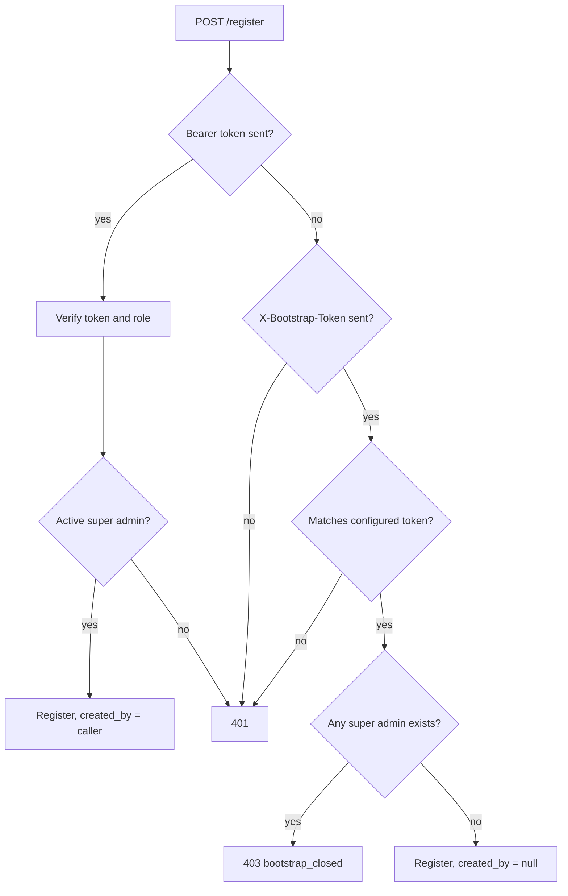
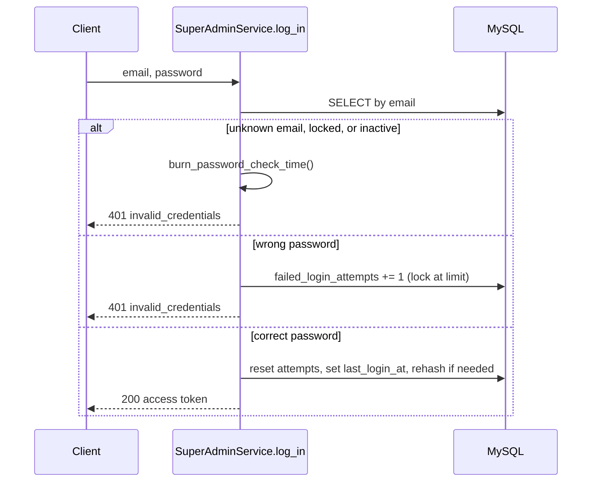

# Super Admins

> Package: `app/features/super_admins/`
> Last updated: 2026-09-28

## Overview

Super admins are platform operators with full access to the integration
service. This feature registers them, logs them in with email and
password, and resolves their bearer token on later requests.

Super admins cannot sign up freely. The first account is created with a
one-time bootstrap token; every later account must be registered by an
existing super admin.

## Endpoints

| Method | Path                            | Summary                     | Auth                                  |
|--------|---------------------------------|-----------------------------|---------------------------------------|
| POST   | `/v1/super-admins/register` | Register a super admin      | Super admin token, or bootstrap token for the first account |
| POST   | `/v1/super-admins/login`    | Log in                      | None                                  |
| GET    | `/v1/super-admins/me`       | Current super admin profile | Super admin token                     |

### `POST /v1/super-admins/register`

Request:

```json
{
  "email": "admin@example.com",
  "full_name": "Platform Admin",
  "password": "a long passphrase of 12+ characters"
}
```

- `email` is lower-cased before saving, so uniqueness ignores case.
- `password` must be 12–128 characters. There are no composition rules
  (NIST SP 800-63B); length matters more.
- Unknown fields are rejected, so a client cannot set `is_active` or
  similar.

Response `201 Created`:

```json
{
  "id": "00000000-0000-0000-0000-000000000000",
  "email": "admin@example.com",
  "full_name": "Platform Admin",
  "is_active": true,
  "last_login_at": null,
  "created_at": "2026-09-28T05:49:22.635000Z"
}
```

Errors:

| Status | `error.code`                 | When                                               |
|--------|------------------------------|----------------------------------------------------|
| 401    | `authentication_failed`      | No credentials, invalid token, or wrong bootstrap token |
| 403    | `bootstrap_closed`           | Correct bootstrap token, but a super admin already exists |
| 409    | `super_admin_already_exists` | Email already registered                           |
| 422    | `validation_error`           | Invalid email, short password, blank name, unknown field |

### `POST /v1/super-admins/login`

Request: `{"email": "...", "password": "..."}`

Response `200 OK` (sent with `Cache-Control: no-store`):

```json
{
  "access_token": "<jwt>",
  "token_type": "bearer",
  "expires_in": 1799,
  "expires_at": "2026-09-28T06:19:22.774000Z"
}
```

Every failure returns `401 invalid_credentials` with the message
"Invalid email or password.", whatever the reason.

### `GET /v1/super-admins/me`

Send `Authorization: Bearer <access_token>`. Returns the same shape as
the registration response.

## Creating the first super admin

1. Make sure `SUPER_ADMIN_BOOTSTRAP_TOKEN` is set in `.env` (at least 32
   random characters).
2. Call register with the token in a header:

   ```bash
   curl -X POST http://localhost:8000/v1/super-admins/register \
     -H "Content-Type: application/json" \
     -H "X-Bootstrap-Token: <token from .env>" \
     -d '{"email": "admin@example.com", "full_name": "Platform Admin", "password": "<a long passphrase>"}'
   ```

   In Swagger UI, put the token in the endpoint's `x-bootstrap-token`
   field, **not** in the Authorize dialog. Authorize sends it as a
   Bearer token, which fails with "Invalid or expired token". When
   `X-Bootstrap-Token` is sent it takes precedence over any
   `Authorization` header, so a stale token left in Authorize does not
   get in the way.

3. Remove `SUPER_ADMIN_BOOTSTRAP_TOKEN` from the environment. The
   endpoint already refuses it once an account exists; removing it
   also takes the code path out of play entirely.

## Flow

### Registration access check



The token is checked *before* looking at whether bootstrap is closed,
so a caller without the token learns nothing about the system's state.

### Login



## Data model

Table `super_admins` (migration `8da3816dcae0`):

| Column                  | Type          | Notes                                |
|-------------------------|---------------|--------------------------------------|
| `id`                    | `CHAR(32)`    | UUID primary key                     |
| `email`                 | `VARCHAR(254)`| Unique (`uq_super_admins_email`)     |
| `full_name`             | `VARCHAR(150)`|                                      |
| `password_hash`         | `VARCHAR(255)`| Argon2id                             |
| `is_active`             | `TINYINT(1)`  | Default `1`                          |
| `failed_login_attempts` | `INT`         | Default `0`                          |
| `locked_until`          | `DATETIME`    | UTC, nullable                        |
| `last_login_at`         | `DATETIME`    | UTC, nullable                        |
| `created_by_id`         | `CHAR(32)`    | FK to `super_admins.id`, `SET NULL` on delete |
| `created_at`, `updated_at` | `DATETIME` | UTC                                  |

## Configuration

| Env var                        | Default | Purpose                                |
|--------------------------------|---------|----------------------------------------|
| `SUPER_ADMIN_BOOTSTRAP_TOKEN`  | unset   | Enables first-account registration     |
| `LOGIN_MAX_FAILED_ATTEMPTS`    | `5`     | Wrong passwords before lockout         |
| `LOGIN_LOCKOUT_MINUTES`        | `15`    | How long a locked account is refused   |
| `ACCESS_TOKEN_EXPIRE_MINUTES`  | `30`    | Token lifetime                         |
| `JWT_SECRET_KEY`               | —       | Token signing key                      |

## Design decisions

- **One error for every login failure.** Distinct messages for "no such
  account" or "account locked" would let anyone test which emails are
  registered. Locks and wrong passwords are logged with the account id
  so operators can still see what happened.
- **Equal timing.** Paths that skip the real password check run a dummy
  Argon2 verification so response time does not reveal the same
  information.
- **Account looked up on every request.** `/me` and other protected
  routes load the super admin from the database, so deactivating an
  account blocks it immediately, not when its token expires.
- **Rehash on login.** If Argon2 parameters are raised in a future
  pwdlib release, hashes upgrade the next time each admin logs in.
- **Unique index decides races.** Two simultaneous registrations for
  the same email both pass the lookup; the database's unique constraint
  rejects the second, which is reported as `409`.

## Known limitations

- No refresh tokens or logout; tokens are valid until they expire.
- No per-IP rate limiting. Account lockout slows guessing against one
  account but not password spraying across many. Add rate limiting at
  the gateway or with middleware before exposing this publicly.
- Lockout increments are read-modify-write, so parallel wrong-password
  requests can undercount by a few attempts.
- No endpoints yet to deactivate, update, or list super admins.
- Two bootstrap requests sent at the same instant could both succeed.
  Only holders of the bootstrap token can do this, and removing the
  token after setup closes the gap.

## Testing

- `tests/features/super_admins/test_registration.py` — bootstrap,
  authenticated registration, duplicates, validation.
- `tests/features/super_admins/test_login.py` — login, lockout, token
  expiry, forged tokens, role checks.

Tests run against in-memory SQLite (see `tests/conftest.py`), so they
need no MySQL server.
