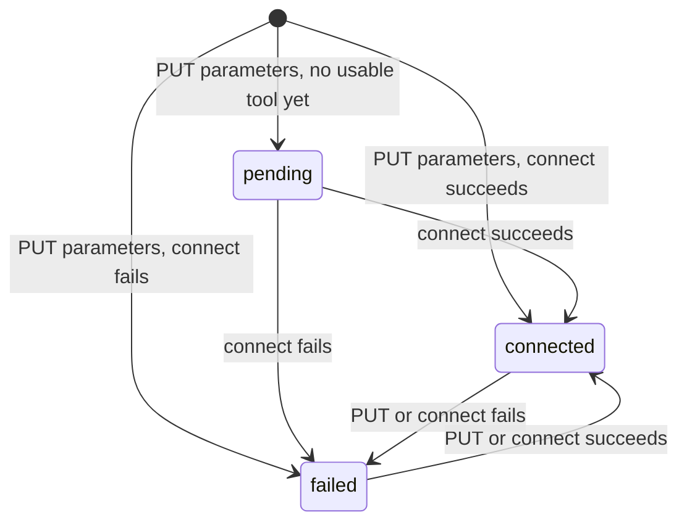
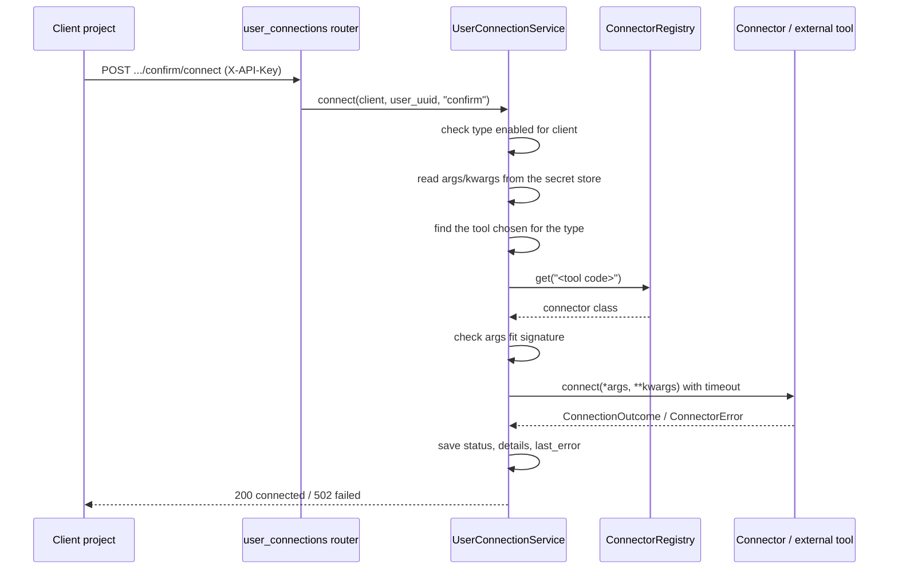

# User Connections

> Package: `app/features/user_connections/` (connectors in `app/connectors/`)
> Last updated: 2026-10-01

## Overview

A client project connects each of **its own users** to the integrations
it has enabled. For every (user, integration type) pair the client
stores the positional and keyword arguments the integration tool needs,
and then asks the service to connect. The service calls the connector
the client chose for that type (see
[integration tools](integration_tools.md)) as:

```python
await connector.connect(*args, **kwargs)
```

The user is identified by the client's own `user_uuid`; this service
keeps no user accounts. The client is identified by its API key, never
by the URL, so a client can only reach its own users.

Inputs may contain secrets. They are kept in the
[secret store](../core/secret_store.md) (AWS Secrets Manager with KMS
in deployed environments); the database holds only a reference and
the kwarg names. Values are never returned by the API.

Besides **connect**, a client can run any **operation** its tool
offers for a user (for example a document check), which is how your
backend calls providers such as [SurePass](../integrations/surepass.md).

## Endpoints

All routes require `X-API-Key`.

| Method | Path | Summary |
|--------|------|---------|
| GET    | `/api/v1/client/users/{user_uuid}/integrations` | The integrations the user is connected to, grouped by type |
| GET    | `/api/v1/client/users/{user_uuid}/connections` | List the user's connections |
| GET    | `/api/v1/client/users/{user_uuid}/connections/{integration_type_code}` | Get one connection |
| PUT    | `/api/v1/client/users/{user_uuid}/connections/{integration_type_code}` | Save `args` / `kwargs` and connect |
| POST   | `/api/v1/client/users/{user_uuid}/connections/{integration_type_code}/connect` | Connect again with the saved parameters |
| POST   | `/api/v1/client/users/{user_uuid}/connections/{integration_type_code}/operations/{operation}` | Run one operation of the tool |
| DELETE | `/api/v1/client/users/{user_uuid}/connections/{integration_type_code}` | Delete the connection |

### A user's integrations with connection status

`GET /api/v1/client/users/{user_uuid}/integrations` returns the same
envelope and group shape as the client's Integrations screen
([client integrations](client_integrations.md#list)), for one user.
Each group lists the tool the client routes that type through, plus
built-in tools such as the Holder Wallet App.

```json
{
  "status": "success",
  "data": {
    "user_uuid": "00000000-0000-0000-0000-000000000001",
    "groups": [
      {
        "id": "…",
        "key": "confirm",
        "label": "CONFIRM - Identity & verification",
        "description": "Identity & verification",
        "systems": [
          {
            "id": "…",
            "code": "surepass",
            "source_role_id": "…",
            "name": "SurePass",
            "status_note": "Indian KYC: Aadhaar OTP and PAN verification.",
            "is_connected": true,
            "is_active": true,
            "is_default": true,
            "status": "connected",
            "tool_status": "connected",
            "connection_id": "…",
            "last_attempt_at": "2026-10-01T09:00:00Z",
            "last_connected_at": "2026-10-01T09:00:00Z",
            "last_error": null
          }
        ]
      }
    ]
  },
  "message": "User integrations retrieved successfully."
}
```

| `status` | Meaning |
|----------|---------|
| `not_connected` | No connection saved for this type yet |
| `pending` | Parameters saved, but the type has no usable tool to connect through yet |
| `connected` | The user's last connection attempt succeeded |
| `failed` | The last attempt failed; see `last_error` |
| `unavailable` | The user cannot connect: the client has the tool switched off, has not stored its credentials, or no connector is installed |

- `is_connected` is `status == "connected"`; `is_active` is "the user
  can use the tool now".
- `tool_status` is the tool's status for the client, as on the client's
  own screen; it explains an `unavailable`.
- An `unavailable` system keeps `connection_id` and the timestamps, so a
  user connected before the client switched the tool off still shows
  when that was.
- Any `user_uuid` is accepted; a user never seen before is
  `not_connected` everywhere.
- By default only `connected` systems are returned: tools the user has
  a connection to (a row in `user_integration_connections` with status
  `connected`). Built-in tools such as the Holder Wallet App follow the
  same rule; the client's own screen still shows them as connected. All
  groups are still listed; those with nothing connected have an empty
  `systems` list.
- Other statuses are returned only when asked for with `status`
  (repeatable), e.g. `?status=not_connected&status=pending` for tools
  the user has not finished connecting.

### Save parameters

```bash
curl -X PUT \
  http://localhost:8000/api/v1/client/users/<user_uuid>/connections/confirm \
  -H "X-API-Key: <client api key>" \
  -H "Content-Type: application/json" \
  -d '{"args": ["<provider token>"], "kwargs": {"region": "in"}}'
```

Rules:

- `args`: up to 20 JSON values.
- `kwargs`: up to 50 entries; names must be Python identifiers, not
  keywords, and not start with `_`.
- Whole payload at most 16 KB.
- If a connector is registered for the type, the parameters must fit
  its `connect` signature; otherwise `422 invalid_connection_parameters`
  explains what is missing or extra.

Saving replaces earlier parameters, then **connects with them in the
same request**. The parameters are committed first, so they are kept
whatever happens next:

| Outcome | `status` | HTTP |
|---------|----------|------|
| The connector accepts | `connected`, with `connection_details` and `last_connected_at` | `200` |
| The provider refuses, or the client's setup is incomplete (e.g. tool credentials not stored) | `failed`, with the reason in `last_error` | `200` |
| The type has no usable tool yet (none chosen, switched off, or no connector) | `pending` | `200` |

Response (values are never included):

```json
{
  "id": "00000000-0000-0000-0000-000000000000",
  "client_id": "00000000-0000-0000-0000-000000000000",
  "user_uuid": "11111111-1111-4111-8111-111111111111",
  "integration_type_code": "confirm",
  "integration_type_name": "Confirm",
  "status": "connected",
  "parameters": {"arg_count": 1, "kwarg_names": ["region"]},
  "connection_details": {"account_ref": "acct-in"},
  "last_error": null,
  "last_attempt_at": "2026-09-28T12:00:00Z",
  "last_connected_at": "2026-09-28T12:00:00Z",
  "created_at": "2026-09-28T12:00:00Z",
  "updated_at": "2026-09-28T12:00:00Z"
}
```

### Connect again

Saving already connects. Use this to retry with the saved parameters,
for example after a `failed` attempt or once the client has finished
setting the tool up.

```bash
curl -X POST \
  http://localhost:8000/api/v1/client/users/<user_uuid>/connections/confirm/connect \
  -H "X-API-Key: <client api key>"
```

- Success: `200`, `status: "connected"`, and `connection_details`
  holding whatever non-secret facts the connector returned.
- Failure: `502 connection_failed`. The connection is saved with
  `status: "failed"` and `last_error`, so it can be inspected later.

### Run an operation

```bash
curl -X POST \
  http://localhost:8000/api/v1/client/users/<user_uuid>/connections/confirm/operations/verify_document \
  -H "X-API-Key: <client api key>" \
  -H "Content-Type: application/json" \
  -d '{"kwargs": {"id_number": "<document number>"}}'
```

- Request `kwargs` are merged **over** the user's saved kwargs; `args`,
  if sent, replace the saved ones.
- The client's credentials for the tool are read from the secret store
  and passed to the connector for this call only.
- A provider saying "no" is `200` with `success: false`. Errors mean the
  call could not be made (see the table below).
- Each call writes a row to `integration_operation_logs` with metadata
  only: client, user, tool, operation, outcome, status, duration, and
  request id. Inputs and results are never stored.

## Statuses



## Errors

| Status | `error.code` | When |
|--------|--------------|------|
| 401 | `invalid_api_key` | Missing or unusable API key |
| 403 | `integration_not_enabled` | The client has not enabled this type, or the type is inactive |
| 404 | `integration_type_not_found` | Unknown type code |
| 404 | `connection_not_found` | No parameters saved for this user and type |
| 409 | `conflict` | Two saves for the same connection raced; retry |
| 422 | `validation_error` | Bad user UUID, kwarg name, or size |
| 422 | `invalid_connection_parameters` | Parameters do not fit the connector signature |
| 409 | `integration_tool_not_selected` | No tool chosen for this type for the client |
| 409 | `integration_tool_inactive` | The chosen tool has been deactivated |
| 501 | `connector_not_available` | The chosen tool has no connector yet |
| 502 | `connection_failed` | Connector rejected, crashed, or timed out |
| 404 | `operation_not_found` | The tool has no operation with that name |
| 409 | `tool_credentials_missing` | The client has not stored credentials the tool needs |
| 422 | `missing_inputs` | Required `kwargs` are missing; the message names them |
| 502 | `operation_failed` | Provider unreachable, timed out, or sent non-JSON |
| 503 | `secret_store_unavailable` | The secret store could not be reached |

## Flow



## Data model

Table `user_integration_connections` (migrations `d5a8114493b4`,
`087d594969e4`):

| Column | Type | Notes |
|--------|------|-------|
| `id` | `CHAR(32)` | UUID |
| `client_id` | `CHAR(32)` | FK `clients`, `CASCADE` |
| `user_uuid` | `CHAR(32)` | The client's user id |
| `integration_type_id` | `CHAR(32)` | FK `integration_types`, `RESTRICT` |
| `parameters_secret_reference` | `VARCHAR(1024)` | Secret store reference (ARN in AWS) to `{"args", "kwargs"}` |
| `parameter_summary` | `JSON` | `{"arg_count", "kwarg_names"}`, so listings never read the secret |
| `status` | `VARCHAR(20)` | `pending`, `connected`, `failed` |
| `connection_details` | `JSON` | Non-secret connector output |
| `last_error` | `VARCHAR(500)` | Safe failure message |
| `last_attempt_at`, `last_connected_at` | `DATETIME` | UTC |

Unique per (`client_id`, `user_uuid`, `integration_type_id`), indexed on
(`client_id`, `user_uuid`).

Table `integration_operation_logs`: one row per operation call, with
`client_id` (set to null if the client is deleted), `user_uuid`,
`integration_type_code`, `tool_code`, `operation`, `succeeded`,
`provider_status_code`, `error_code`, `duration_ms`, `request_id`, and
`created_at`.

## Configuration

| Env var | Default | Purpose |
|---------|---------|---------|
| `SECRET_STORE_BACKEND` | `local` | `aws` in deployed environments (see [secret store](../core/secret_store.md)) |
| `CONNECTION_ENCRYPTION_KEYS` | required | Encrypts the local secret store |
| `CONNECTOR_TIMEOUT_SECONDS` | `30` | Maximum time a connector may take |

## Design decisions

- **Signature check before calling.** Parameters are bound against the
  connector's `connect` signature on save and again before each
  connect, so mistakes surface as a clear `422` instead of a
  `TypeError` inside the connector.
- **Failures are recorded, then reported.** The attempt is committed
  before the `502` is returned, so the client can read `last_error`
  afterwards.
- **Connector bugs cannot leak secrets.** An unexpected exception is
  stored as a generic message, and only its type and stack frames are
  logged. `ConnectorError` messages are shown to clients, so connectors
  must keep credentials out of them.
- **Client from the key only.** No `client_id` in the path means there
  is nothing to mismatch and no way to address another client's users.

## Known limitations

- A tool answers `501` until it has a connector: either a
  `connector_config` or Python code (see [connectors](../connectors.md)).
- Connecting runs inside the request. Tools that take longer than a
  few seconds should move to a background job.
- No disconnect call to the external tool on delete; only the stored
  parameters are removed.

## Testing

- `tests/features/user_connections/test_parameters.py` — saving,
  encryption at rest, validation, isolation between clients and users.
- `tests/features/user_connections/test_connect.py` — success, provider
  rejection, crashes, timeouts, missing connectors, and log hygiene.
- `tests/features/user_connections/test_operations.py` — the full HTTP
  tool flow: definition, credentials, operations, audit, and errors.
- `tests/connectors/test_registry.py` — registry and signature checks.
