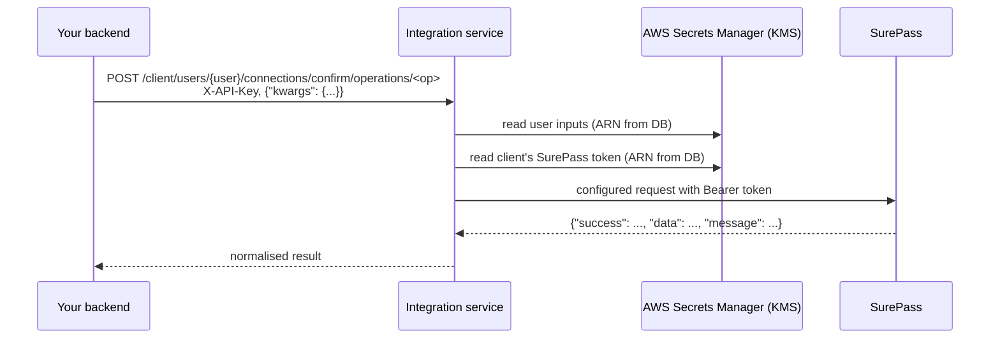

# SurePass Integration

> Last updated: 2026-09-29

SurePass is connected through the **configuration-driven HTTP
connector**: there is no SurePass-specific code. Its base URLs, auth
header, and operations are data saved on the `surepass` tool, and each
client's SurePass token is kept in AWS Secrets Manager.



## Before you start

**Check the configuration against SurePass's official docs.** The base
URLs in `docs/examples/surepass-tool.json` come from public sources, not
from SurePass's own reference. Confirm them, and whether your account
also needs an `X-Customer-Id` header, in your SurePass dashboard or API
reference before going live.

The example ships with **no operations**. Add each SurePass endpoint
you use (step 1), copying its exact path and request fields from the
SurePass API reference.

## 1. Define the tool

Add operations to `docs/examples/surepass-tool.json`. Each one maps the
inputs your backend sends (`{kwargs.<name>}`) to SurePass's fields. For
an endpoint documented as `POST /some/path` with body
`{"id_number": "..."}`:

```json
"operations": {
  "verify_document": {
    "method": "POST",
    "path": "/some/path",
    "description": "What this check does",
    "body": {"id_number": "{kwargs.id_number}"}
  }
}
```

If your account needs the customer id header, add it next to
`Authorization`:

```json
"headers": {
  "Authorization": "Bearer {credentials.api_token}",
  "X-Customer-Id": "{credentials.customer_id}"
}
```

Save it (super admin token):

```bash
curl -X PUT http://localhost:8000/api/v1/integration-tools/surepass \
  -H "Authorization: Bearer <super admin token>" \
  -H "Content-Type: application/json" \
  --data @docs/examples/surepass-tool.json
```

The configuration is validated on save: HTTPS URLs, relative paths,
known placeholders, and auth headers that come only from
`{credentials.*}`. A token pasted directly into the file is rejected.

Change `integration_types` to every type SurePass serves for you.

## 2. Store each client's SurePass credentials

```bash
curl -X PUT http://localhost:8000/api/v1/clients/<client_id>/tools/surepass/credentials \
  -H "Authorization: Bearer <super admin token>" \
  -H "Content-Type: application/json" \
  -d '{"credentials": {"api_token": "<SurePass token>"}}'
```

Add `"customer_id"` if you added that header. The token goes to Secrets
Manager (encrypted with your KMS key); the database keeps its ARN and
the names `["api_token"]`. It is never returned by any endpoint. Call
the same endpoint again to rotate it.

## 3. Choose SurePass for the client

```bash
curl -X PUT http://localhost:8000/api/v1/clients/<client_id>/integrations/confirm \
  -H "Authorization: Bearer <super admin token>" \
  -H "Content-Type: application/json" \
  -d '{"is_enabled": true, "tool_code": "surepass", "settings": {"environment": "sandbox"}}'
```

`settings.environment` picks `sandbox` or `production` from the tool's
`environments`. Clients can change it with
`PUT /api/v1/client/integrations/confirm/settings`, but only to a name
the tool defines, never to a URL.

## 4. Your backend: connect a user and run operations

All calls use the client's `X-API-Key`.

Save inputs that stay the same for the user (optional):

```bash
curl -X PUT http://localhost:8000/api/v1/client/users/<user_uuid>/connections/confirm \
  -H "X-API-Key: <client key>" -H "Content-Type: application/json" \
  -d '{"kwargs": {}}'
```

Run an operation:

```bash
curl -X POST http://localhost:8000/api/v1/client/users/<user_uuid>/connections/confirm/operations/verify_document \
  -H "X-API-Key: <client key>" -H "Content-Type: application/json" \
  -d '{"kwargs": {"id_number": "<document number>"}}'
```

```json
{
  "operation": "verify_document",
  "integration_type_code": "confirm",
  "tool_code": "surepass",
  "success": true,
  "provider_status_code": 200,
  "data": {"...": "SurePass's data object"},
  "message": null
}
```

`GET /api/v1/client/integration-tools` lists each operation with the
`kwargs` it needs, so your backend can build requests without
hard-coding them.

## Handling results in your backend

| Response | Meaning | What to do |
|----------|---------|------------|
| `200`, `success: true` | SurePass verified | Use `data` |
| `200`, `success: false` | SurePass answered "no" (invalid document, mismatch) | Show `message` to the user |
| `409 tool_credentials_missing` | No token stored for this client | Store credentials (step 2) |
| `422 missing_inputs` | A `kwargs` value is missing; the message names it | Fix the request |
| `502 operation_failed` | SurePass unreachable, timed out, or sent non-JSON | Retry with backoff |
| `503 secret_store_unavailable` | Secrets Manager unreachable | Retry later; check AWS |

## Privacy

- SurePass results can contain personal data. They are returned to your
  backend and **not stored** by this service.
- Each call is written to `integration_operation_logs` with the client,
  user, operation, outcome, and duration only, never inputs or results.
- User inputs saved with `PUT .../connections/confirm` are stored in
  Secrets Manager. Save only what you need to reuse; send one-off values
  such as document numbers per call instead.
